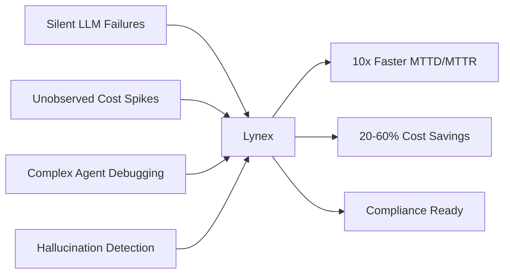

  <div align="center">


### **The last observability platform you'll ever need for AI**
# ⁍    S E N T R Y   F O R   A I    ⁌

*Every token traced • Every dollar accounted • Every hallucination caught*

[](https://sentryai.dev)
[](https://twitter.com/kaadz_zz)
[](https://sentryai.dev)

## Sentry for AI — AI Observability Platform

<div align="center">

```ascii
██╗     ██╗   ██╗███╗   ██╗███████╗██╗  ██╗
██║     ██╔╝ ██╔╝████╗  ██║██╔════╝╚██╗██╔╝
██║     ╚██╗██╔╝ ██╔██╗ ██║█████╗   ╚███╔╝ 
██║      ╚███╔╝  ██║╚██╗██║██╔══╝   ██╔██╗ 
███████╗ ╚██╔╝   ██║ ╚████║███████╗██╔╝ ██╗
╚══════╝  ╚═╝    ╚═╝  ╚═══╝╚══════╝╚═╝  ╚═╝

S E N T R Y   F O R   A I

Real-time observability for production LLMs, agents, RAG pipelines, and AI workflows.
```  

### **The Sentry + Datadog + LangSmith for AI/Agent Workflows**

[](https://lynex.dev)
[](https://twitter.com/yourusername)
[](https://discord.gg/lynex)
[](LICENSE)


</div>

---

## 🚀 Currently Building: **Lynex**

> **Mission:** Help teams ship AI features faster, at lower cost and risk, by giving them instant, actionable visibility into prompts, model calls, tool calls, pipeline health, costs, and failure modes.

<div align="center">

### 🎯 **The Problem We're Solving**

</div>



---

## ⚡ What Makes Lynex Different

<table>
<tr>
<td width="50%">

### 🔍 **Deep Observability**
- Real-time LLM pipeline monitoring
- Agent step-by-step debugger
- Tool call chain visualization
- Prompt versioning & diffing
- Multi-model comparison UI

</td>
<td width="50%">

### 💰 **Cost Intelligence**
- Per-call cost breakdown
- Anomaly detection for spend spikes
- Token usage optimization insights
- Budget alerts & controls
- ROI tracking per model/prompt

</td>
</tr>
<tr>
<td width="50%">

### 🛡️ **Security & Governance**
- Hallucination detection engine
- PII scanning & auto-masking
- Policy rules enforcement
- Compliance audit trails (SOC2, HIPAA)
- Encrypted-at-rest + VPC options

</td>
<td width="50%">

### 🚢 **Developer First**
- One-line SDK integration
- Python + JavaScript + API
- OpenTelemetry compatible
- Slack/PagerDuty/Datadog integrations
- Self-serve onboarding

</td>
</tr>
</table>

---

## 💻 Quick Start

```python
# Install
pip install ai-sentry

# Initialize (literally one line)
from aisentry import Client
client = Client(api_key="your_key")

# Start logging
client.log_prompt(
    project_id="my-app",
    prompt="Analyze this customer feedback...",
    model="gpt-4o-mini"
)
```

```javascript
// Node.js
import { AISentry } from 'ai-sentry';

const client = new AISentry({ apiKey: 'your_key' });
await client.logPrompt({
  projectId: 'my-app',
  prompt: 'Generate product description...',
  model: 'claude-sonnet-4'
});
```

---

## 🎨 Tech Stack

<div align="center">


</div>

---

## 📊 Feature Roadmap

<details>
<summary><b>✅ MVP (Shipped)</b></summary>

- [x] One-line SDK (Python + JavaScript)
- [x] Real-time ingestion API
- [x] Timeline dashboard with search
- [x] Basic alerts (webhooks + email)
- [x] Token usage & cost tracking
- [x] Free tier + billing integration

</details>

<details>
<summary><b>🚧 In Progress</b></summary>

- [ ] Agent step debugger with replay
- [ ] Model & prompt diffing
- [ ] Hallucination detection engine
- [ ] Tool call chain visualization
- [ ] Slack/PagerDuty integrations
- [ ] Synthetic monitoring

</details>

<details>
<summary><b>🎯 Coming Soon</b></summary>

- [ ] Multi-model comparison UI
- [ ] Automated prompt scorer & optimizer
- [ ] LLM assertions & invariants
- [ ] SSO/RBAC for teams
- [ ] VPC/on-prem deployment
- [ ] Compliance certifications (SOC2, ISO27001)

</details>

---

## 🎯 Target Customers

<div align="center">

| Segment | Description | Pricing |
|---------|-------------|---------|
| 🏠 **Indie Builders** | Solo AI devs, rapid prototyping | $9-39/mo |
| 🚀 **Startups** | 1-20 devs, need reliability + cost control | $49-499/mo |
| 🏢 **Mid-Market** | 20-200 devs, governance + compliance | $999-5k/mo |
| 🏛️ **Enterprise** | Custom contracts, on-prem, SLAs | Custom |

</div>

---

## 🌟 Value Proposition

<div align="center">

### **Reduce MTTD/MTTR by 10x**
### **Save 20-60% on Model Spend**
### **Ship AI Features with Confidence**

</div>

---

## 📈 Growth Metrics (Building in Public)

<div align="center">

```
┌─────────────────────────────────────────────┐
│  📊 Current MRR:     [GROWING]              │
│  👥 Active Projects:  [SCALING]             │
│  🚀 Weekly Signups:   [ACCELERATING]        │
│  ⚡ Avg Onboarding:   < 5 minutes           │
└─────────────────────────────────────────────┘
```

</div>

---

## 🤝 Connect & Collaborate

<div align="center">

**Let's build the future of AI observability together**

[](https://twitter.com/yourusername)
[](https://linkedin.com/in/yourprofile)
[](https://discord.gg/lynex)
[](mailto:you@lynex.dev)
[](https://whop.com/lynex)

</div>

---

## 🎁 Special Offers

<div align="center">

**🔥 Early Adopter Program**
> Get 50% off your first 6 months + priority feature requests

**💼 Agency/Consultant Program**
> Refer clients, earn 20% recurring commission

**🎓 Student/OSS Developer Program**
> Free Pro plan for qualifying projects

</div>

---

## 📚 Resources

- 📖 [Documentation](https://docs.lynex.dev)
- 🎥 [Video Tutorials](https://youtube.com/@lynex)
- 📝 [Blog & Case Studies](https://lynex.dev/blog)
- 🧪 [Example Projects](https://github.com/yourusername/lynex-examples)
- 💬 [Community Discord](https://discord.gg/lynex)

---

## 🌎 We're Hiring!

<div align="center">

**Building the observability layer for the AI era**

Interested in:
- **Backend Engineering** (Python, Go, Kafka, ClickHouse)
- **Frontend Engineering** (React, TypeScript, data visualization)
- **DevRel** (developer advocacy, content creation)
- **Growth** (PLG strategies, developer marketing)

[View Open Positions →](https://lynex.dev/careers)

</div>

---

<div align="center">

### ⭐ Star the repo to follow our journey!

```
 _   _          _   _____ _                _ 
| \ | |   _____| |_|_   _(_)_ __ ___   ___| |
|  \| |  / _ \ \ /  | | | | '_ ` _ \ / _ \ |
| |\  | |  __/>  <  | | | | | | | | |  __/_|
|_| \_|  \___/_/\_\ |_| |_|_| |_| |_|\___(_)
```

**Because every AI system deserves world-class observability**


</div>

---

<div align="center">
<sub>Built with ❤️ for the AI developer community | © 2024 Lynex | MIT License</sub>
</div>
