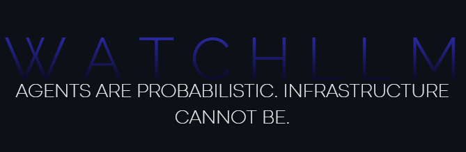

<!-- Animated scanline header -->
<picture>
  
</picture>

<h3>
  <samp>⚠️ CLASSIFIED // OPERATOR: KAADZ // CLEARANCE: INFRA</samp>
</h3>

&nbsp;

<!-- Animated typewriter terminal card -->

<pre style="background:#0d1117;color:#58a6ff;padding:20px;border-radius:8px;border:1px solid #30363d;text-align:left;display:inline-block;max-width:700px;overflow-x:auto">
┌──────────────────────────────────────────────────────────────────┐
│ <b style="color:#f0883e">root@kaadz:~$</b> whoami                                       │
│ → founder, WatchLLM | building deterministic agent governance   │
│                                                                  │
│ <b style="color:#f0883e">root@kaadz:~$</b> cat /etc/motd                                  │
│ → <i>"Agents are probabilistic. Infrastructure cannot be."</i>      │
│                                                                  │
│ <b style="color:#f0883e">root@kaadz:~$</b> ls -la /projects/                              │
│ -rw-r--r--  watchllm-oss   agent governance • kernel • AST rules  │
│ -rw-r--r--  klyd           architectural memory for agents           │
│ -rw-r--r--  replay         DAG execution forensics                   │
│ -rw-r--r--  hermes         the agent that grows with you              │
│                                                                  │
│ <b style="color:#f0883e">root@kaadz:~$</b> uptime                                        │
│ → 24/7/365 · building the future of agent safety                 │
└──────────────────────────────────────────────────────────────────┘
</pre>

&nbsp;

<!-- Stats cards -->

<table>
<tr>
<td align="center" width="200">
  <samp><b>🔭 OSS</b></samp> 
  <a href="https://github.com/WatchLLM/watchllm-oss"><samp>WatchLLM/wllm-oss</samp></a> 
  MIT · kernel + schemas + vscode
</td>
<td align="center" width="200">
  <samp><b>🔒 CORE</b></samp> 
  <a href="https://watchllm.dev"><samp>WatchLLM Cloud</samp></a> 
  Rust/WASM · replay · reliability
</td>
<td align="center" width="200">
  <samp><b>🧪 LABS</b></samp> 
  <a href="https://github.com/kaadipranav/hermes-agent"><samp>hermes-agent</samp></a> 
  personal agents · experiments
</td>
</tr>
</table>

&nbsp;

<!-- Tech stack - horizontal badges -->

  <samp>
  
  
  
  
   
  
  
  
  
  </samp>

&nbsp;

<!-- Animated typing SVG -->

&nbsp;

<!-- Pinned-style project showcase with animated collapsible -->

<samp>📂 <b>PROJECT_MANIFEST/</b> — click to expand</samp>

 

<table>
<tr>
<td width="50%">

### 🔓 OPEN SOURCE

[**WatchLLM OSS**](https://github.com/WatchLLM/watchllm-oss) `MIT`
> Deterministic governance kernel for autonomous coding agents. Tree-sitter AST parsing, boundary/auth/secrets rules, CLI.

[**hermes-agent**](https://github.com/kaadipranav/hermes-agent) `Python`
> The agent that grows with you — memory, reflection, and tool-use from scratch.

[**BOILERPLATE**](https://github.com/kaadipranav/BOILERPLATE) `TypeScript`
> Next.js + TypeScript project starter. Zero to deployed in one command.

[**Kaadz**](https://github.com/kaadipranav/Kaadz) `TypeScript`
> Personal website and portfolio.

</td>
<td width="50%">

### 🔒 CLOSED SOURCE

**WatchLLM Runtime** `Rust/WASM`
> High-performance governance engine. WebAssembly target for cross-platform deployment.

**klyd** `Python/SQLite`
> Persistent architectural memory for agents. SQLite-backed, git-hook integrated.

**replay** `TypeScript/ReactFlow`
> DAG execution forensics. Observe every decision your agents made.

**reliability** `Python`
> Adversarial stress-testing harness. Safety index scoring.

</td>
</tr>
</table>

&nbsp;

---

<samp>

[🌐 watchllm.dev](https://watchllm.dev) &nbsp;·&nbsp;
[🐦 @kaad_zz](https://twitter.com/kaad_zz) &nbsp;·&nbsp;
[📧 kaadi@watchllm.dev](mailto:kaadi@watchllm.dev)

</samp>

 

<samp>the only jobs i'll have are cron jobs</samp>

<!--
                  _   _  ___
                 | | / |/ _ \
                 | |/ / /_\ \___
                 |    <|  _  / __|
                 | |\  \ | | \__ \
                 \_| \_/\_| |_/___/

         you found the hidden message. you're my kind of visitor.
         if you're building something at the intersection of
         agents, infrastructure, and determinism — reach out.
         kaadi@watchllm.dev
-->