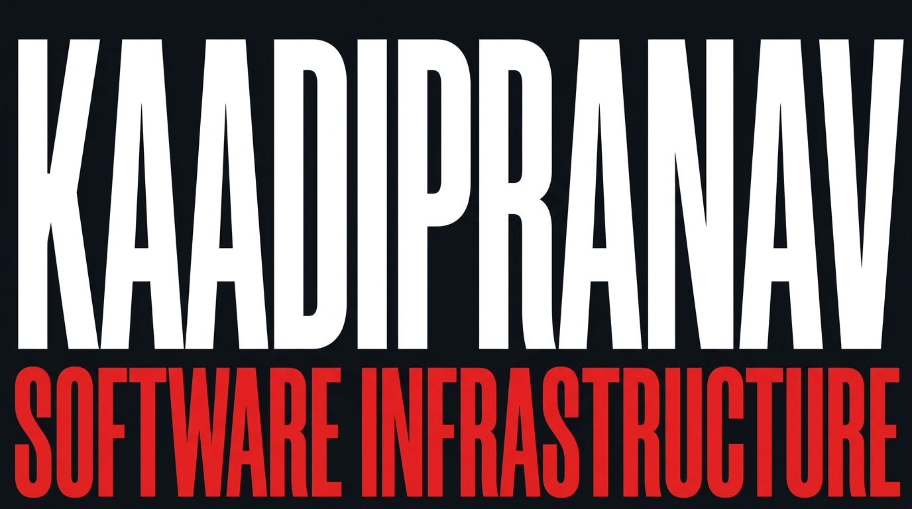

  

# Kaadipranav

### I build infrastructure for coding agents, cybersecurity, and technical education.

My work focuses on systems that make complex software workflows more reliable, inspectable, and usable by other people.

---

## Selected work

### WatchLLM
Deterministic runtime governance for autonomous coding agents.

[Repository](https://github.com/WatchLLM/watchllm-oss) · [Website](https://watchllm.dev) · [Documentation](https://docs.watchllm.dev) · [Quickstart Demo](https://github.com/WatchLLM/watchllm-oss#quickstart)

### Klyd
Decision memory for coding agents.

[Repository](https://github.com/klyd-studio/klyd-harness) · [PyPI](https://pypi.org/project/klyd/) · [Documentation](https://github.com/klyd-studio/klyd-harness#the-workflow)

### Codify
A student-built coding platform for a student-run coding club.

[Repository](https://github.com/Codify-PSBB/CODIFY-WEBAPP-CORE) · [Platform information](https://github.com/Codify-PSBB/CODIFY-WEBAPP-CORE#why-codify-exists)

### Sanboxx
A desktop cybersecurity demonstration combining ClamAV detection with explainable incident narration.

[Repository](https://github.com/Sanb0xx/SANBOXX-FINAL) · [Demo / recognition](https://github.com/Sanb0xx/SANBOXX-FINAL#context)

---

## How the projects connect

Existing systems lose important context, permit unsafe actions, or fail to support the people using them.

I tend to respond by building infrastructure:

- **WatchLLM** governs agent actions.
- **Klyd** preserves engineering decisions.
- **Codify** supports practical programming education.
- **Sanboxx** makes cybersecurity detection understandable.

---

## Technical areas

- Python
- Rust
- TypeScript
- React
- SQLite / D1
- Cloudflare Workers
- AST analysis
- Agent infrastructure
- Cybersecurity
- Developer tooling

---

## Outside software

I also organize and teach through Codify, a student-run coding organization at school.
