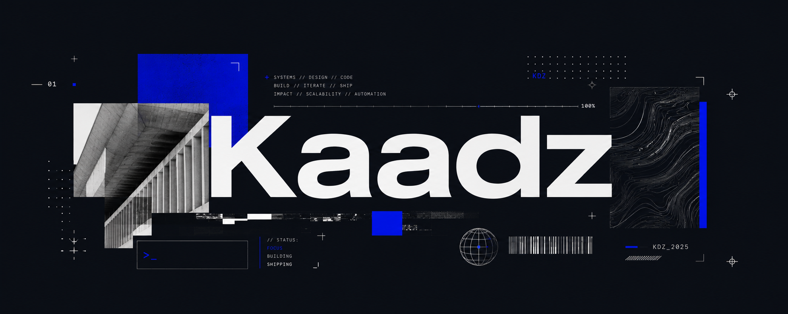

<div align="center">
  
</div>

<br/>

# Kaadipranav

### I build infrastructure for coding agents, cybersecurity, and technical education.

My work focuses on systems that make complex software workflows more reliable, inspectable, and usable by other people.

---

## Selected work

### [WatchLLM](https://github.com/WatchLLM/watchllm-oss)
> **Deterministic runtime governance for autonomous coding agents.**

An open-core platform that intercepts file operations from coding agents (like Claude Code and Aider), parses them with Tree-sitter AST, and blocks unsafe operations (secrets leaks, boundary violations, unauthenticated mutations) before code reaches disk.

* **Tech:** TypeScript · Python · Rust · Tree-sitter · JSON Schema · VS Code IPC
* **Status:** Open-Core Kernel (v0.1.1) · Monorepo Development
* **Links:** [Repository](https://github.com/WatchLLM/watchllm-oss) · [Website](https://watchllm.dev) · [Documentation](https://docs.watchllm.dev) · [Quickstart Demo](https://github.com/WatchLLM/watchllm-oss#quickstart)

---

### [Klyd](https://github.com/klyd-studio/klyd-harness)
> **Decision memory for coding agents.**

A local memory harness that uses Git hooks to capture architectural decisions from commit diffs via LLM call, stores them in SQLite with vector embeddings, and re-injects relevant constraints into future agent sessions to prevent architectural drift.

* **Tech:** Python 3.11 · SQLite (C-runtime custom functions & recursive CTEs) · Git Hooks · BYOK LLMs
* **Status:** Distributed on PyPI (`v0.2.2`)
* **Links:** [Repository](https://github.com/klyd-studio/klyd-harness) · [PyPI: klyd](https://pypi.org/project/klyd/) · [Architecture & Workflow](https://github.com/klyd-studio/klyd-harness#the-workflow)

---

### [Codify](https://github.com/Codify-PSBB/CODIFY-WEBAPP-CORE)
> **A student-built coding platform for a student-run coding club.**

A purpose-built competition and assignment platform running in school computer labs. Features client-side Python execution via Pyodide WASM, manual admin review workflows, and serverless SQLite atomic scoring with zero RCE attack surface.

* **Tech:** React · Vite · Monaco Editor · Pyodide (WASM) · Cloudflare Workers · Cloudflare D1 · WebCrypto
* **Status:** Internal tool deployed at PSBB Schools (~50–68 registered students in Grades 8–9 cohort)
* **Links:** [Repository](https://github.com/Codify-PSBB/CODIFY-WEBAPP-CORE) · [Platform Information](https://github.com/Codify-PSBB/CODIFY-WEBAPP-CORE#why-codify-exists)

---

### [Sanboxx](https://github.com/Sanb0xx/SANBOXX-FINAL)
> **A desktop cybersecurity demonstration combining ClamAV detection with explainable incident narration.**

A standalone Electron desktop application built in a rapid 6-day sprint for Innovision 2026. Pairs real `clamscan` binary subprocess execution with high-speed Groq LLM inference to explain detected threats in plain English during live exhibit demos.

* **Tech:** Electron · React · TailwindCSS · Node.js Child Process · ClamAV · Groq API (gpt-oss-20b)
* **Status:** Solo-built exhibition demonstrator · Reported first-place result at Innovision 2026
* **Links:** [Repository](https://github.com/Sanb0xx/SANBOXX-FINAL) · [Demo Context & Recognition](https://github.com/Sanb0xx/SANBOXX-FINAL#context)

---

## How the projects connect

Existing systems lose important context, permit unsafe actions, or fail to support the people using them.

I tend to respond by building infrastructure:

| Infrastructure | Core Responsibility | Solves |
|---|---|---|
| **WatchLLM** | Governs agent write paths deterministically | Unsafe / unauthenticated code written by autonomous agents |
| **Klyd** | Preserves architectural decision lineage in Git | Architectural decay and context amnesia across agent turns |
| **Codify** | Supports practical programming education | Fragile manual lab coordination and unsafe student RCE |
| **Sanboxx** | Makes cybersecurity detection understandable | Inscrutable raw CLI antivirus output for non-specialists |

---

## Technical areas

```
┌──────────────────────────────┬──────────────────────────────┐
│ Compilers, ASTs & Systems    │ Cloud, Edge & Databases      │
│ • Python (3.10+) · Rust      │ • Cloudflare Workers & KV    │
│ • Tree-sitter AST Parsing    │ • SQLite / Cloudflare D1     │
│ • JSON Schema Draft-07       │ • Recursive CTEs & C-Funcs   │
├──────────────────────────────┼──────────────────────────────┤
│ Agent Infrastructure         │ Frontend & Desktop           │
│ • Git Hook Interception      │ • TypeScript · React · Vite  │
│ • Deterministic Governance   │ • Electron (Context Isolated)│
│ • Decision Memory & Vectors  │ • Monaco Editor · Pyodide   │
└──────────────────────────────┴──────────────────────────────┘
```

---

## Outside software

I also organize and teach through **Codify**, a student-run coding organization at school. We run weekly hands-on programming labs, prepare problem sets, and supervise live competitions to make computer science practical and accessible for younger students.
