# 👋 Kaadz | Building WatchLLM

<div align="center">

```ascii
██╗    ██╗ █████╗ ████████╗ ██████╗██╗  ██╗██╗     ██╗     ███╗   ███╗
██║    ██║██╔══██╗╚══██╔══╝██╔════╝██║  ██║██║     ██║     ████╗ ████║
██║ █╗ ██║███████║   ██║   ██║     ███████║██║     ██║     ██╔████╔██║
██║███╗██║██╔══██║   ██║   ██║     ██╔══██║██║     ██║     ██║╚██╔╝██║
╚███╔███╔╝██║  ██║   ██║   ╚██████╗██║  ██║███████╗███████╗██║ ╚═╝ ██║
 ╚══╝╚══╝ ╚═╝  ╚═╝   ╚═╝    ╚═════╝╚═╝  ╚═╝╚══════╝╚══════╝╚═╝     ╚═╝
```

### *Cut AI costs by 70% • Semantic caching for LLM APIs*

[](https://watchllm.dev)
[](https://proxy.watchllm.dev)
[](https://twitter.com/kaad_zz)

[](https://twitter.com/kaad_zz)
[](https://github.com/kaadipranav)

</div>

---

## Currently Building

<table>
<tr>
<td width="60%">

### WatchLLM
**Drop-in OpenAI proxy with semantic caching**

```typescript
const client = new OpenAI({
  apiKey: 'lgw_proj_xxxxx',
  baseURL: 'https://proxy.watchllm.dev/v1'
});

// That's it. 70% savings activated.
```

**Impact:**
- 🔥 70% cost reduction on AI API bills
- ⚡ <50ms cache hit response time
- 🚀 5-minute integration time
- 🌍 Edge deployment on Cloudflare

**Stack:** TypeScript • Next.js • Hono • Cloudflare Workers • Supabase • Redis

**Status:** 🟢 Live at [watchllm.dev](https://watchllm.dev)

```mermaid
graph TD
    A[Your App] -->|Request| B[WatchLLM Edge]
    B -->|Cache Check| C{Semantic Match?}
    C -->|✅ HIT| D[Return <50ms]
    C -->|❌ MISS| E[OpenAI/Anthropic]
    E -->|Cache + Return| D
    style B fill:#00ff88,stroke:#00cc66
    style D fill:#ffeb3b,stroke:#ffc107
    style E fill:#ff6b6b,stroke:#cc5555
```

</td>
<td width="40%">



</td>
</tr>
</table>

---

## Tech Stack

```typescript
const kaadz = {
  languages: ['TypeScript', 'Python', 'JavaScript'],
  frontend: ['React', 'Next.js 14', 'TailwindCSS'],
  backend: ['Hono', 'Node.js', 'Cloudflare Workers'],
  databases: ['PostgreSQL', 'Supabase', 'Upstash Redis'],
  deployment: ['Vercel', 'Cloudflare', 'Docker'],
  tools: ['Git', 'VS Code', 'Linear', 'Cursor'],
  currentFocus: 'Building WatchLLM to $1K MRR',
  sleepSchedule: 'Optional'
};
```

---

## GitHub Stats

<div align="center">


</div>

---

## Contribution Graph

<picture>
  <source media="(prefers-color-scheme: dark)" srcset="https://raw.githubusercontent.com/kaadipranav/kaadipranav/output/github-contribution-grid-snake-dark.svg">
  <source media="(prefers-color-scheme: light)" srcset="https://raw.githubusercontent.com/kaadipranav/kaadipranav/output/github-contribution-grid-snake.svg">
  
</picture>

---

## What I'm Up To

```bash
$ cat current_focus.txt
```
- 📈 Scaling WatchLLM to first $1K MRR
- 🏗️ Building in public on Twitter [@kaad_zz](https://twitter.com/kaad_zz)
- 💰 Learning growth & monetization
- 🎯 Shipping fast, iterating faster
- 🤝 Open to collaboration on indie projects

---

## Let's Connect

<div align="center">

[](https://Kaadz.me)
[](https://twitter.com/kaad_zz)
[](https://indiehackers.com/kaadz)
[](mailto:kiwi092020@gmail.com)

</div>

---

<div align="center">

**"Building products that make AI affordable for everyone"**

*Solo indie maker • TypeScript enthusiast • Building @watchllm*


</div>
