<div align="center">

```ascii
██╗    ██╗ █████╗ ████████╗ ██████╗██╗  ██╗██╗     ██╗     ███╗   ███╗
██║    ██║██╔══██╗╚══██╔══╝██╔════╝██║  ██║██║     ██║     ████╗ ████║
██║ █╗ ██║███████║   ██║   ██║     ███████║██║     ██║     ██╔████╔██║
██║███╗██║██╔══██║   ██║   ██║     ██╔══██║██║     ██║     ██║╚██╔╝██║
╚███╔███╔╝██║  ██║   ██║   ╚██████╗██║  ██║███████╗███████╗██║ ╚═╝ ██║
 ╚══╝╚══╝ ╚═╝  ╚═╝   ╚═╝    ╚═════╝╚═╝  ╚═╝╚══════╝╚══════╝╚═╝     ╚═╝
```

# ⁍ S E N T R Y  F O R  A I ⁌

*Every token traced • Every dollar accounted • Every hallucination caught*

[](https://WatchLLM.dev)
[](https://twitter.com/kaadz_zz)
[](https://WatchLLM.dev)

[](https://twitter.com/kaadz_zz)
[](https://discord.gg/WatchLLM)


</div>

---

<div align="center">

## 🎯 The Sentry + Datadog + LangSmith for AI

**10x faster MTTD/MTTR** • **20-60% cost savings** • **Compliance-ready from day one**

```mermaid
graph LR
    A[🔴 Silent Failures] --> E[⚡ WatchLLM]
    B[💸 Cost Spikes] --> E
    C[🤖 Agent Chaos] --> E
    D[🎭 Hallucinations] --> E
    E --> F[📊 Full Visibility]
    E --> G[💰 Cost Control]
    E --> H[🛡️ Compliance]
```

</div>



---

## ⚡ One-Line Integration

<table>
<tr>
<td width="50%">

```python
pip install watchllm

from aisentry import Client
c = Client(api_key="sk_xxx")
c.log_prompt(
  project_id="prod",
  prompt="Analyze...",
  model="gpt-4o-mini"
)
```

</td>
<td width="50%">

```javascript
npm i watchllm

import { AISentry } from 'watchllm';
const c = new AISentry({ 
  apiKey: 'sk_xxx' 
});
await c.logPrompt({
  projectId: 'prod',
  prompt: 'Generate...'
});
```

</td>
</tr>
</table>

---

## 🔥 Core Features

<div align="center">

| 🔍 Observability | 💰 Cost Intel | 🛡️ Security | 🚢 DevEx |
|:---:|:---:|:---:|:---:|
| LLM pipeline monitoring | Per-call breakdown | Hallucination detection | One-line SDK |
| Agent step debugger | Spend anomalies | PII auto-masking | OpenTelemetry |
| Tool call chains | Token optimization | Policy enforcement | Slack/PagerDuty |
| Prompt versioning | Budget alerts | SOC2/HIPAA audit trails | 5min onboarding |

</div>

---

## 🎨 Built With

<div align="center">


</div>

---

## 📊 Roadmap

<div align="center">

| ✅ Shipped | 🚧 Building | 🎯 Next |
|:---|:---|:---|
| SDK (Py/JS) | Agent debugger | Multi-model UI |
| Real-time API | Hallucination engine | Prompt optimizer |
| Timeline dashboard | Tool call viz | LLM assertions |
| Alerts & webhooks | Cost anomalies | SSO/RBAC |
| Token tracking | Slack integration | VPC/on-prem |

</div>

---

## 💎 Pricing

<div align="center">

| 🏠 Indie | 🚀 Startup | 🏢 Team | 🏛️ Enterprise |
|:---:|:---:|:---:|:---:|
| **$9/mo** | **$49/mo** | **$199/mo** | **Custom** |
| 500K tokens | 5M tokens | 20M tokens | Unlimited |
| Basic alerts | Team seats | SSO/RBAC | On-prem |
| Email support | Slack alerts | SLA | White-glove |

**🎁 50% OFF** for early adopters • **Free** for OSS projects

</div>

---

## 🔗 Quick Links

<div align="center">

📖 [**Docs**](https://docs.WatchLLM.dev) • 
🎥 [**Demos**](https://youtube.com/@WatchLLM) • 
💬 [**Discord**](https://discord.gg/WatchLLM) • 
🐦 [**Twitter**](https://twitter.com/kaadz_zz) • 
🛍️ [**WHOP**](https://whop.com/WatchLLM)

</div>

---

## 📈 Building in Public

<div align="center">

```ascii
┌───────────────────────────────────────┐
│  📊  MRR: $X → $Y (↑Z%)              │
│  👥  Active Projects: 100+            │
│  🚀  Weekly Signups: Accelerating     │
│  ⚡  Onboarding Time: < 5min          │
│  🔥  Dogfooding: 15K+ req/day         │
└───────────────────────────────────────┘
```

Follow the journey: [@kaadz_zz](https://twitter.com/kaadz_zz)

</div>

---

<div align="center">

### ⭐ Star to follow • 🔔 Watch for updates • 🍴 Fork to build

```
Because every AI system deserves world-class observability
```


---

<sub>Built with ❤️ for AI builders | MIT Licensed | © 2024 WatchLLM</sub>

</div>
